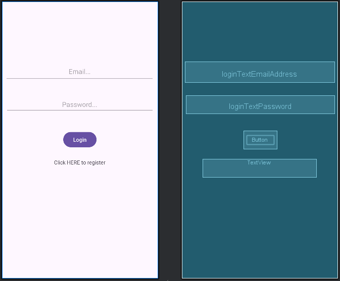
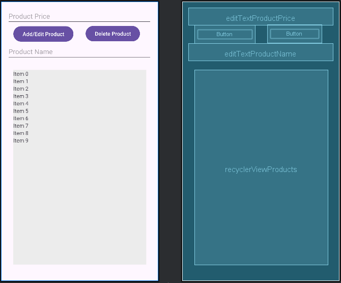
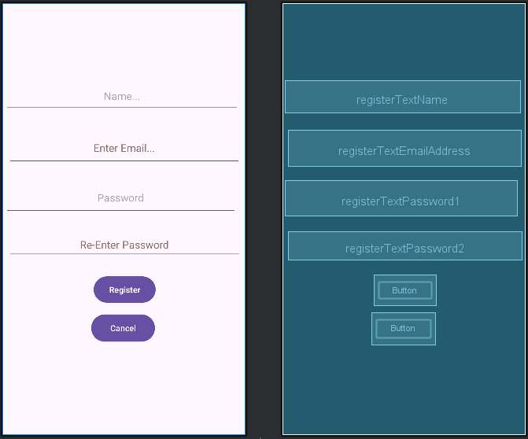
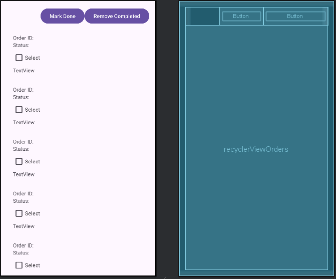
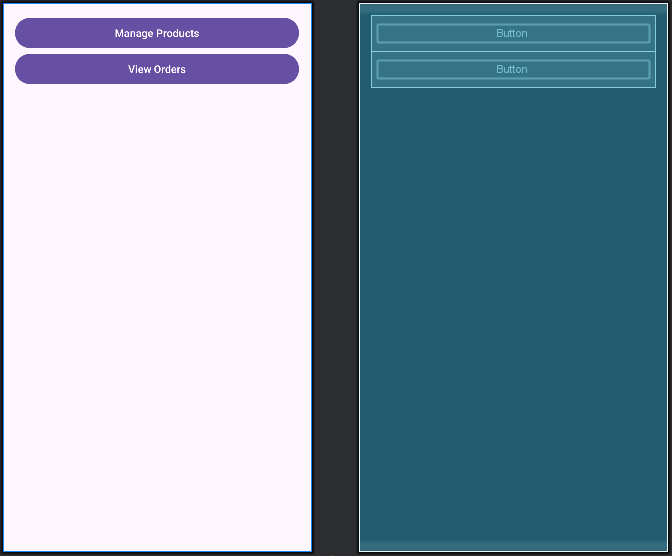

# Fancy Café Management App

**Fancy Café Management App** is a feature-rich Android application built with **Kotlin** to streamline café operations. It offers an efficient admin dashboard for product and order management, along with a clean, user-friendly interface for customers to browse the menu, place orders, and receive real-time updates.

---

## 🚀 Key Features

### 🔐 User Authentication
Secure login and registration powered by **Firebase Authentication**.

### 🧑‍💼 Admin Dashboard
Admins can:
- Add, update, and remove products
- View and manage customer orders
- Update order statuses in real-time

### 🛒 Order Management
Customers can:
- Browse the menu
- Place orders
- Track order status and receive notifications when their order is ready

### 🔄 Firebase Integration
- Real-time database for syncing product listings, orders, and user information
- Reliable and fast data access

### ♻️ RecyclerView Adapters
- Smooth and efficient display of products and orders
- Interactive UI components for seamless user experience

This app offers a full-featured solution to manage day-to-day operations of a café, improving both staff workflow and customer satisfaction.

---

## 📱 Screenshots

### Screenshot 1

### Screenshot 2

### Screenshot 3

### Screenshot 4

### Screenshot 5

---

## 🛠 Tech Stack

- **Kotlin** (Android development)
- **Firebase** (Authentication, Realtime Database)
- **RecyclerView** (Dynamic UI components)
- **Glide** (Optional: image handling if used)

---

